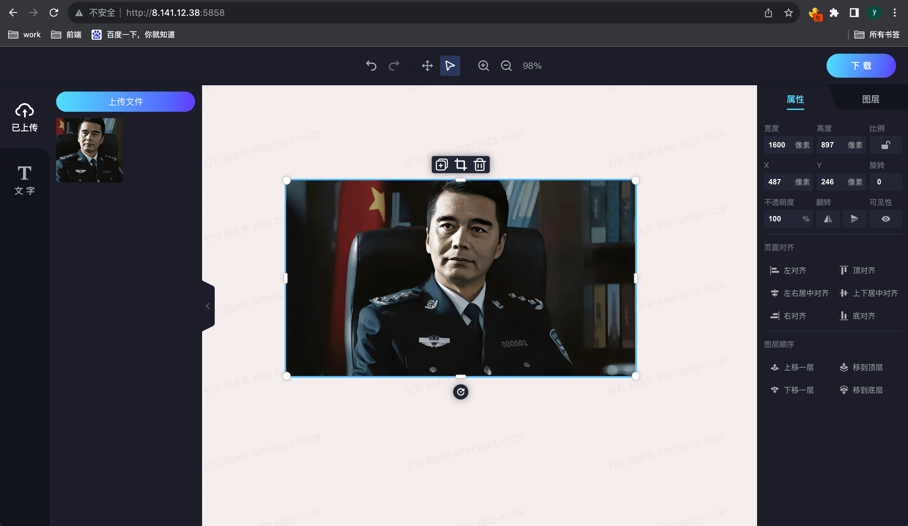
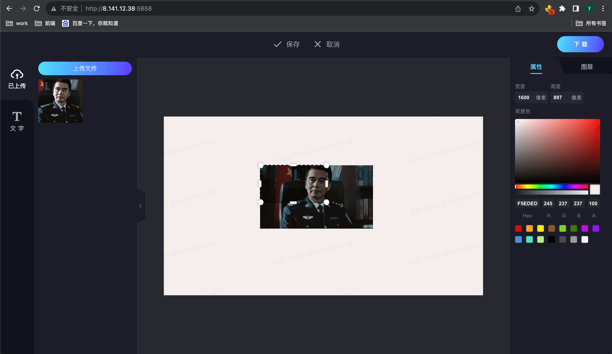
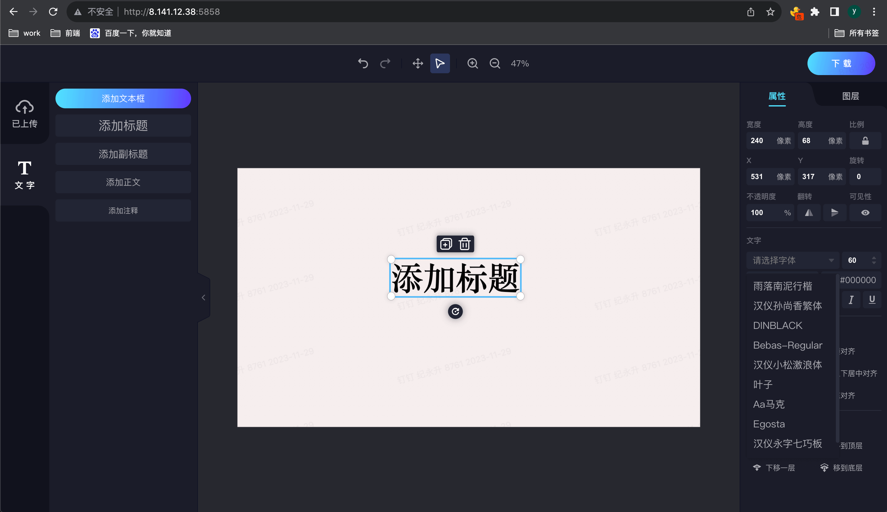
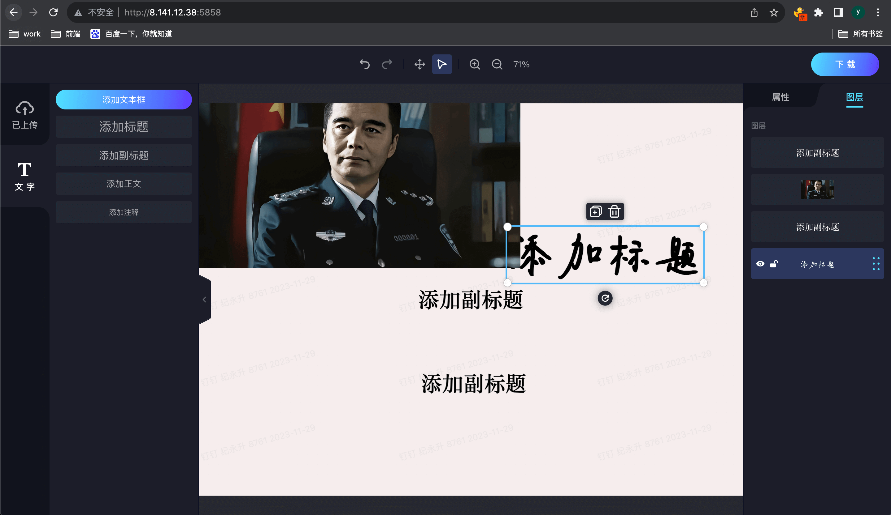
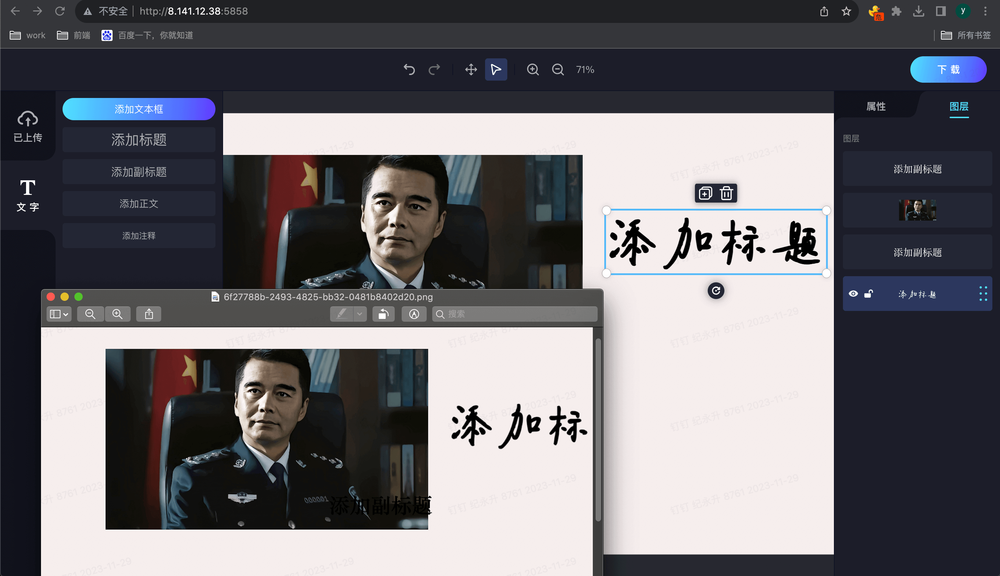

# fabric-edit-image

## 简介

这是一个使用React.js、Fabric.js和Node.js开发的简单图片编辑器组件。它允许用户上传图片，并使用工具栏进行裁剪、旋转、缩放等编辑操作。最后，用户可以将编辑后的图片保存到本地。

## 安装

1. 克隆仓库：

```bash
git clone https://github.com/kukudeshengge/fabirc-edit-image.git
```

2. 安装依赖和启动项目：

```bash
cd fabric-edit-image
npm install
npm start

cd /server
npm install
npm start

cd /example
npm install
npm start
```

## 使用方法

1. 打开浏览器，访问`http://localhost:3000`，你将看到图片编辑器组件。
2. 点击“上传图片”，选择你要编辑的图片。
3. 使用工具栏进行编辑，如裁剪、旋转、缩放等。
4. 点击“保存”按钮，图片将被保存到本地。

## 图片
1.	锁定比例：此选项可以确保元素的宽高比例保持不变。当您调整其中一个尺寸时，另一个尺寸将自动调整以保持比例。
2. 位置：您可以通过输入具体数值或使用拖动条来调整元素在画布中的水平（x）和垂直（y）位置。
3. 旋转角度：此选项允许您以度数为单位旋转元素，以获得所需的角度。
4. 不透明度度：通过调整不透明度选项，您可以控制元素的透明度。较低的值会使元素变得更加透明，而较高的值会使其更加不透明。
5. 上下翻转和左右翻转：这两个选项可以将元素在垂直和水平方向上进行翻转。
6. 可见性：通过调整可见性选项，您可以控制元素在画布上的显示和隐藏。
7. 裁剪图片：可自由裁剪图片

## 文字
1.	修改字体：您可以选择不同的字体样式来改变文字的外观。文生图图片编辑器提供了多种字体供您选择，包括经典字体和时尚字体。
2.	修改字体大小：您可以调整文字的大小，使其更加突出或适应图像的布局。通过增大或减小字体大小，您可以获得理想的效果。
3.	下划线、斜体、粗体：文生图图片编辑器允许您对文字应用下划线、斜体和粗体效果。这些样式可以使文字更加醒目和有吸引力。
4.	修改颜色：您可以改变文字的颜色，以便与图像背景或其他元素相匹配。文生图图片编辑器提供了丰富的颜色选项，让您可以自由选择适合的颜色。
5.	对齐方式：您可以选择文字的对齐方式，包括左对齐、右对齐、居中对齐等。根据设计需求，选择合适的对齐方式可以使文字在图像中更好地呈现。

## 预览
> [在线预览](http://8.141.12.38:5858/)

* 上传图片 修改属性


* 裁剪图片


* 添加文字 修改属性


* 修改图层顺序


* 保存图片

